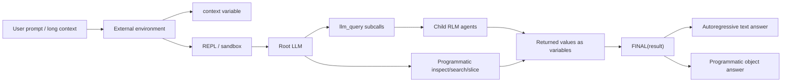
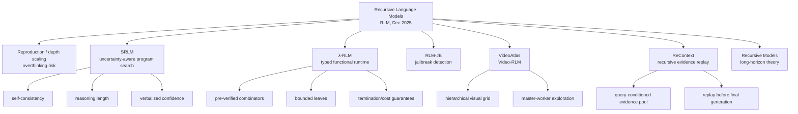
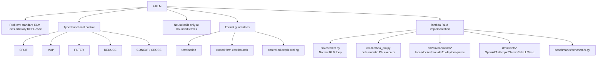
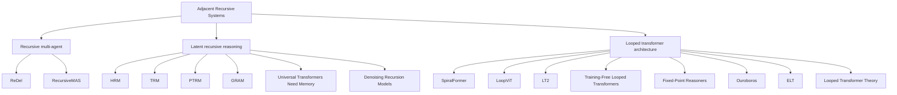
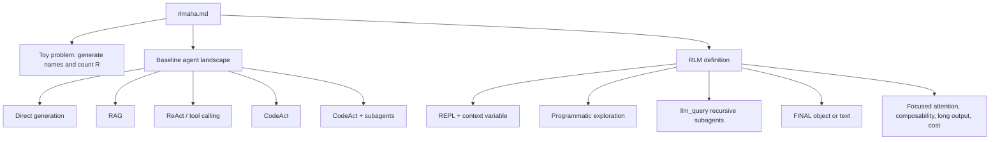

# RLM Research Graph

Tarih: 2026-07-05  
Kapsam: `mylist.md`, `docs/rlmaha.md`, internet taraması, ve `lambda-RLM` kod grafı.

Bu dosya RLM ile ilgili yerel notları, paper listesini ve kod mimarisini tek bir Markdown graph olarak toplar. Buradaki "RLM" iki ana aileye ayrılıyor:

- **Recursive Language Models / inference scaffold**: Prompt dış ortamda tutulur; model REPL, programmatic search ve recursive subcall ile çalışır.
- **Recursive / looped neural reasoning**: Model veya blok tekrar tekrar uygulanır; latent state, memory token, adaptive depth veya looped transformer ile hesaplama derinliği artırılır.

## Top-Level Graph

```mermaid
flowchart TD
  RLM["RLM / Recursive Reasoning Landscape"]

  RLM --> SCAFFOLD["Inference-Time RLM Scaffold"]
  RLM --> LAMBDA["Typed / λ-RLM Line"]
  RLM --> EVIDENCE["Evidence / Program Search Extensions"]
  RLM --> SAFETY["Safety & Domain Applications"]
  RLM --> MULTI["Recursive Multi-Agent Systems"]
  RLM --> LATENT["Latent Recursive Reasoning Models"]
  RLM --> LOOPED["Looped / Recursive Transformers"]
  RLM --> LOCAL["Local Repo & Notes"]

  SCAFFOLD --> RLM_PAPER["Recursive Language Models"]
  SCAFFOLD --> REPRO["Think, But Don't Overthink"]
  SCAFFOLD --> LONGHORIZON["Recursive Models for Long-Horizon Reasoning"]

  LAMBDA --> LAMBDA_PAPER["Y-Combinator for LLMs / λ-RLM"]
  LAMBDA --> LAMBDA_REPO["lambda-RLM repo graph"]
  LAMBDA --> EPIC["Opportunistically Parallel Lambda Calculus"]

  EVIDENCE --> SRLM["SRLM"]
  EVIDENCE --> RECONTEXT["ReContext"]

  SAFETY --> RLMJB["RLM-JB"]
  SAFETY --> VIDEOATLAS["VideoAtlas / Video-RLM"]

  MULTI --> REDEL["ReDel"]
  MULTI --> RECURSIVEMAS["RecursiveMAS"]

  LATENT --> HRM["HRM"]
  LATENT --> TRM["TRM"]
  LATENT --> PTRM["PTRM"]
  LATENT --> GRAM["GRAM"]
  LATENT --> UTM["Universal Transformers Need Memory"]
  LATENT --> DRM["Denoising Recursion Models"]

  LOOPED --> SPIRAL["SpiralFormer"]
  LOOPED --> LOOPVIT["LoopViT"]
  LOOPED --> LT2["LT2"]
  LOOPED --> TFLOOP["Training-Free Looped Transformers"]
  LOOPED --> FPRM["Fixed-Point Reasoners"]
  LOOPED --> OURO["Ouroboros"]
  LOOPED --> ELT["ELT"]
  LOOPED --> LOOPTHEORY["Looped Transformers Theory"]

  LOCAL --> RLMAHA["docs/rlmaha.md"]
  LOCAL --> MYLIST["mylist.md RLM lines"]
  LOCAL --> KG["lambda-RLM knowledge-graph.json"]
```

## Core RLM Mechanics

RLM'nin ana iddiası: model uzun prompt'u baştan sona context window içine almak yerine, prompt'u dış ortamda tutar ve ihtiyacı olan parçaları seçerek inceler. `docs/rlmaha.md` bunu REPL, `context`, `llm_query`, `FINAL(...)`, output truncation ve subagent değişkenleri üzerinden anlatıyor.

## Verified Paper Graph

| Cluster | Paper / Resource | Role in graph | Key claim |
|---|---|---|---|
| Core RLM | [Recursive Language Models](https://arxiv.org/abs/2512.24601) | Root concept | Long prompts live in an external environment; the LLM programmatically examines, decomposes, and recursively calls itself over snippets. |
| Reproduction | [Think, But Don't Overthink](https://arxiv.org/abs/2603.02615) | Depth caution | Depth 1 can help, but depth 2 can cause overthinking, latency, and cost blowups. |
| Program search | [Recursive Language Models Meet Uncertainty / SRLM](https://arxiv.org/abs/2603.15653) | RLM extension/critique | Performance depends heavily on choosing good context-interaction programs; uncertainty signals can guide selection. |
| Typed RLM | [The Y-Combinator for LLMs: Solving Long-Context Rot with λ-Calculus](https://arxiv.org/abs/2603.20105) | Typed alternative | Replaces open-ended REPL control code with typed functional combinators and bounded leaf calls. |
| Theory | [Recursive Models for Long-Horizon Reasoning](https://arxiv.org/abs/2603.02112) | Formal lens | Recursive decomposition can reduce active context needed for long-horizon reasoning. |
| Safety | [Recursive language models for jailbreak detection](https://arxiv.org/abs/2602.16520) | Procedural defense | RLM-JB normalizes, chunks, screens, and aggregates evidence for jailbreak detection. |
| Video | [VideoAtlas](https://arxiv.org/abs/2603.17948) | Visual RLM | Provides a hierarchical visual environment for recursive navigation over long videos. |
| Evidence replay | [ReContext](https://arxiv.org/abs/2607.02509) | Evidence harness | Recursively selects/replays evidence to improve long-context utilization without training. |

## λ-RLM Subgraph

Local `lambda-RLM` graph summary:

| Metric | Value |
|---|---:|
| Files analyzed | 37 |
| Nodes | 141 |
| Edges | 418 |
| Layers | 7 |
| Tour steps | 8 |
| Validation | `issues: []`, `warnings: []` |

Local layers:

| Layer | Count | Meaning |
|---|---:|---|
| Dokümantasyon & Paketleme | 3 | README, notices, package metadata |
| Public API & Benchmark Girişi | 2 | public package surface and benchmark runner |
| RLM Orkestrasyon Çekirdeği | 5 | normal RLM loop, LM handler, socket protocol, runtime types |
| Lambda Fonksiyonel Runtime | 1 | deterministic `LambdaRLM` runtime |
| Yürütme Ortamları | 9 | local and sandbox REPL backends |
| Model Client'ları | 8 | provider adapters |
| Loglama & Yardımcı Araçlar | 9 | logging, parsing, prompts, token accounting, exceptions |

## Adjacent Recursive Systems

| Cluster | Paper / Resource | Relation to RLM |
|---|---|---|
| Recursive multi-agent | [ReDel](https://arxiv.org/abs/2408.02248) | Recursive delegation toolkit: agents can decide when/how to delegate. |
| Recursive multi-agent | [Recursive Multi-Agent Systems](https://arxiv.org/abs/2604.25917) | Moves recursion from single model to multi-agent collaboration loops. |
| Latent recursive reasoning | [Hierarchical Reasoning Model](https://arxiv.org/abs/2506.21734) | Recurrent two-timescale architecture for sequential reasoning. |
| Latent recursive reasoning | [Less is More: Recursive Reasoning with Tiny Networks / TRM](https://arxiv.org/abs/2510.04871) | Tiny recurrent model iteratively refines latent state and answer. |
| Latent recursive reasoning | [Probabilistic Tiny Recursive Model](https://arxiv.org/abs/2605.19943) | Adds stochastic exploration and parallel trajectories to TRM. |
| Latent recursive reasoning | [Generative Recursive Reasoning / GRAM](https://arxiv.org/abs/2605.19376) | Turns recursive latent reasoning into probabilistic multi-trajectory computation. |
| Adaptive recursion | [Universal Transformers Need Memory](https://arxiv.org/abs/2604.21999) | Memory tokens and adaptive computation depth trade off in recursive reasoning. |
| Recursive refinement | [Denoising Recursion Models](https://arxiv.org/abs/2604.18839) | Trains recursive multi-step denoising/refinement rather than one-step prediction. |
| Looped transformer | [SpiralFormer](https://arxiv.org/abs/2602.11698) | Multi-resolution recurrence for hierarchical dependencies. |
| Looped transformer | [LoopViT](https://arxiv.org/abs/2602.02156) | Weight-tied recurrence for visual ARC reasoning. |
| Looped transformer | [LT2: Linear-Time Looped Transformers](https://arxiv.org/abs/2605.20670) | Makes looped transformers more scalable with linear/sparse attention. |
| Looped transformer | [Training-Free Looped Transformers](https://arxiv.org/abs/2605.23872) | Retrofitted inference-time looping over frozen checkpoints. |
| Looped transformer | [Fixed-Point Reasoners](https://arxiv.org/abs/2606.18206) | Adaptive halting via fixed-point convergence in looped transformers. |
| Recursive transformer | [Ouroboros](https://arxiv.org/abs/2604.02051) | Input-conditioned LoRA modulation for recursive transformer steps. |
| Visual generation | [ELT: Elastic Looped Transformers](https://arxiv.org/abs/2604.09168) | Weight-shared recurrent transformers for visual generation and anytime inference. |
| Theory | [What Makes Looped Transformers Perform Better Than Non-Recursive Ones](https://arxiv.org/abs/2510.10089) | Theoretical lens on why looped attention can help complex reasoning. |
| Lambda scripting | [Opportunistically Parallel Lambda Calculus](https://arxiv.org/abs/2405.11361) | Not RLM, but relevant to typed/parallel lambda-based LLM orchestration. |

## Local List Coverage: `mylist.md`

These are the RLM-relevant local list entries found by text scan. I grouped duplicate or near-duplicate entries, but kept the original line anchors so the source can be traced.

| Lines | Local item | Classification | Status after web scan |
|---|---|---|---|
| 30, 499, 736 | `recursive language models` / `Recursive Language Models` | Core RLM | Verified paper: RLM arXiv 2512.24601. |
| 563 | LinkedIn RLM post | Social pointer | Not a formal paper entry by itself; likely points to RLM discussion. |
| 575 | Neural AVB RLM ADAM post | Social pointer | No formal paper found from exact title; keep as follow-up/watchlist. |
| 581 | `Hierarchal Agent Loop Optimizer RLM` | Watchlist | No matching formal paper found from exact string. |
| 583 | `RLM ... video domain ... videoatlas` | Domain application | Verified: VideoAtlas arXiv 2603.17948. |
| 611 | `Recursive Language Models (RLMs) and GEPA ... looped Transformer` | Mixed topic | RLM and looped-transformer connection verified broadly; exact GEPA/AppWorld thread not found as paper. |
| 667, 2408 | `Can Recursive Agents Really Reason Better? DSPy x Daytona` | Blog/benchmark pointer | No formal arXiv result from exact title; keep as non-paper resource. |
| 682, 684, 697, 710 | `Recursive Multi-Agent Systems` | Recursive MAS | Verified: RecursiveMAS arXiv 2604.25917. |
| 734, 752 | `Universal Transformers Need Memory` | Adaptive recursive reasoning | Verified: arXiv 2604.21999. |
| 760, 2504 | `Recursive Language Models - what finally gave me the aha moment` | Article/local note | Local doc exists: `docs/rlmaha.md`. |
| 908 | `Reinforcing Recursive Language Models` | Watchlist | No exact formal paper result found. |
| 943 | `New article is out on Recursive Language Models` | Article pointer | Likely article/social pointer; not a unique paper title. |
| 1021, 1035, 1037, 1041, 1119 | `Generative Recursive Reasoning` | Latent recursive reasoning | Verified: GRAM arXiv 2605.19376. |
| 1031, 1120, 1898 | `Probabilistic Tiny Recursive Model(s)` | Latent recursive reasoning | Verified: PTRM arXiv 2605.19943. |
| 1059, 1122 | `LT2: Linear-Time Looped Transformers` | Looped transformer | Verified: arXiv 2605.20670. |
| 308, 363 | `ELT / Elastic Looped Transformers` | Looped visual generation | Verified: arXiv 2604.09168. |
| 1168, 1563 | `Training-Free Looped Transformers` | Looped transformer | Verified: arXiv 2605.23872. |
| 1702 | `Fixed-Point Reasoners` | Looped/adaptive reasoning | Verified: arXiv 2606.18206. |
| 2963 | `peek dspy rlm` | Tooling/blog pointer | No formal paper from exact string. |
| 3087 | `gpt-5-mini in an rlm ... 10m+ tokens` | Social claim | Treat as unverified social claim unless linked source is provided. |
| 3421, 3816 | `Recursive Language Models by MIT, Clearly Explained` | Explainer | Explainer/video/article pointer, not a paper. |
| 3775 | `programatic subagents in deepagents (RLM like)` | Adjacent tooling | Conceptually related to RLM subagent scaffolds; no exact paper found. |
| 3807 | X post RLM | Social pointer | No formal paper from exact URL text. |
| 3812 | `Going recursive (part I): Applying RLM-GEPA to AppWorld` | Blog/experiment pointer | No arXiv paper found from exact title. |
| 3814 | `RLM Agents live healthier when they talk via Structured Outputs` | Blog/design pointer | No arXiv paper found from exact title. |

## Local Article: `docs/rlmaha.md`

Important local claims:

- Direct generation fails because letter/counting tasks are not naturally next-token prediction.
- ReAct works only if a specific tool exists; otherwise it falls back to generation.
- CodeAct lets the model create code, but the output is still typically read back and regenerated.
- CodeAct + subagents reduces parent context pressure but still loads subagent outputs as text.
- RLM changes the data path: outputs can return as variables instead of being fully read or token-regenerated.
- Parent RLM can compose child results symbolically.

## Concept Map: What To Study First

Recommended reading order:

1. `docs/rlmaha.md` for intuition.
2. [Recursive Language Models](https://arxiv.org/abs/2512.24601) for the canonical scaffold.
3. [λ-RLM](https://arxiv.org/abs/2603.20105) plus local `lambda-RLM/README.md` for typed functional control.
4. [Think, But Don't Overthink](https://arxiv.org/abs/2603.02615) and [SRLM](https://arxiv.org/abs/2603.15653) for limitations and program-selection issues.
5. [VideoAtlas](https://arxiv.org/abs/2603.17948), [RLM-JB](https://arxiv.org/abs/2602.16520), and [ReContext](https://arxiv.org/abs/2607.02509) for domain adaptations.
6. [RecursiveMAS](https://arxiv.org/abs/2604.25917), [TRM](https://arxiv.org/abs/2510.04871), [PTRM](https://arxiv.org/abs/2605.19943), [GRAM](https://arxiv.org/abs/2605.19376), and looped transformer papers for adjacent architectures.

## Design Axes

| Axis | RLM scaffold | λ-RLM | Latent recursive models | Looped transformers |
|---|---|---|---|---|
| Where recursion happens | Agent/scaffold calls | Typed runtime combinators | Latent state refinement | Shared transformer blocks |
| Context handling | External `context` + selective reads | Partitioned leaves + symbolic composition | Fixed input/state representations | Iterative hidden-state updates |
| Control flow | LLM-generated code/actions | Pre-verified functional operators | Learned recurrence | Architectural loop schedule |
| Main risk | Unbounded/opaque REPL behavior | Operator library may be too restrictive | Training stability/generalization | Signal propagation/halting |
| Best fit | Long-context QA/search/summarization | Verifiable long-context decomposition | Puzzle/structured reasoning | Efficient deep reasoning/generation |

## Open Watchlist From `mylist.md`

These entries were not verified as formal papers by exact title during the web scan, but they are worth preserving as leads:

- `RLM ADAM`
- `Hierarchal Agent Loop Optimizer RLM`
- `Reinforcing Recursive Language Models`
- `Can Recursive Agents Really Reason Better? DSPy x Daytona`
- `peek dspy rlm`
- `RLM-GEPA to AppWorld`
- `RLM Agents live healthier when they talk via Structured Outputs`
- `programatic subagents in deepagents (RLM like)`
- `mit researchers wrapped gpt-5-mini in an rlm...` social claim

If these are important, the next pass should resolve the original URLs/posts and classify them as paper, blog, implementation, or unverified claim.

## Source Index

Local:

- `mylist.md`
- `docs/rlmaha.md`
- `lambda-RLM/.understand-anything/knowledge-graph.json`
- `lambda-RLM/.understand-anything/summary.json`
- `lambda-RLM/README.md`

Web / papers:

- https://arxiv.org/abs/2512.24601
- https://arxiv.org/abs/2603.02615
- https://arxiv.org/abs/2603.15653
- https://arxiv.org/abs/2603.20105
- https://arxiv.org/abs/2603.02112
- https://arxiv.org/abs/2602.16520
- https://arxiv.org/abs/2603.17948
- https://arxiv.org/abs/2607.02509
- https://arxiv.org/abs/2408.02248
- https://arxiv.org/abs/2604.25917
- https://arxiv.org/abs/2506.21734
- https://arxiv.org/abs/2510.04871
- https://arxiv.org/abs/2605.19943
- https://arxiv.org/abs/2605.19376
- https://arxiv.org/abs/2604.21999
- https://arxiv.org/abs/2604.18839
- https://arxiv.org/abs/2602.11698
- https://arxiv.org/abs/2602.02156
- https://arxiv.org/abs/2605.20670
- https://arxiv.org/abs/2605.23872
- https://arxiv.org/abs/2606.18206
- https://arxiv.org/abs/2604.02051
- https://arxiv.org/abs/2604.09168
- https://arxiv.org/abs/2510.10089
- https://arxiv.org/abs/2405.11361

