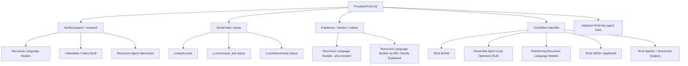

# RLM Source Scan

Tarih: 2026-07-05  
Kaynak: Kullanıcının verdiği `mylist.md` satırları.

Amaç: Aşağıdaki RLM ile ilgili satırların paper, repo, blog/video, sosyal post veya doğrulanamayan claim olarak sınıflandırılması.

## Summary Graph



## Line-by-Line Scan

| Line | Entry | Classification | Scan result |
|---:|---|---|---|
| 30 | `recursive language models` | Core topic | Verified as the canonical RLM paper family. See `Recursive Language Models`, arXiv 2512.24601. |
| 499 | `Recursive Language Models` | Core topic | Same as line 30. |
| 563 | LinkedIn Akshay Pachaar RLM post | Social post | Direct fetch failed / gated. Search by activity id and author did not expose a public mirrored text. Treat as social pointer, not paper. |
| 575 | `x.com/neural_avb/status/2049353251221631084 RLM ADAM` | Social post / watchlist | Direct fetch failed. Search for `RLM ADAM`, `ADAM Recursive Language Models`, and status id found no formal paper. Keep as unresolved lead. |
| 581 | `Hierarchal Agent Loop Optimizer RLM` | Watchlist | Exact and corrected-spelling searches found no formal paper. Possible misspelling or unpublished post. |
| 583 | `RLM ... video domain ... videoatlas` | Verified paper | Verified as `VideoAtlas: Navigating Long-Form Video in Logarithmic Compute`, arXiv 2603.17948. It extends RLM ideas to long-form video through a hierarchical visual environment and Video-RLM master-worker exploration. |
| 611 | RLMs + GEPA + looped Transformer / Claude Mythos | Mixed / watchlist | RLM and looped Transformer research are verified separately, but exact `RLM-GEPA`, `Claude Mythos`, and AppWorld-related paper was not found. Treat as social/blog lead. |
| 736 | `recursive language models` | Core topic | Same verified core RLM cluster. |
| 760 | `Recursive Language Models - what finally gave me the 'aha' moment` | Local article / explainer | Local copy exists at `docs/rlmaha.md`. It explains RLM mechanics via REPL, context variable, programmatic exploration, `llm_query`, and `FINAL`. |
| 908 | `Reinforcing Recursive Language Models` | Watchlist | Exact search found no formal paper. Could be a post title or future/unindexed work. |
| 943 | `New article is out on Recursive Language Models.` | Article pointer | Too generic to resolve. Likely points to a social/article post, not a unique paper title. |
| 2504 | `Recursive Language Models - what finally gave me the 'aha' moment` | Local article / explainer | Duplicate of line 760. |
| 2963 | `peek dspy rlm` | Tooling/blog pointer | No exact formal result found. May refer to DSPy/RLM experiments. Keep as unresolved tooling lead. |
| 3087 | `gpt-5-mini in an rlm ... beat gpt-5 by 28.4% ... 10m+ tokens` | Unverified social claim | Exact searches for the claim found no public source. Related nearby verified work exists: `Recursive Agent Harnesses` reports RLM-like harness recursion over long contexts, but it does not verify this exact GPT-5-mini claim. |
| 3421 | `Recursive Language Models by MIT, Clearly Explained! awi` | Explainer/video pointer | Exact search and YouTube-targeted search found no indexed result. Keep as explainer lead, not paper. |
| 3775 | `programatic subagents in deepagents (RLM like)` | Adjacent verified direction | Exact `deepagents` phrase did not resolve, but the concept maps strongly to `Recursive Agent Harnesses`, arXiv 2606.13643: parent agents spawning subagent harnesses with tools/code execution. |
| 3807 | `x.com/biosemiote/status/2060806285944369656 RLM` | Social post | Direct fetch failed and status id search found no public mirror. Treat as social pointer. |
| 3812 | `Going recursive (part I): Applying RLM-GEPA to AppWorld` | Blog/experiment pointer | Exact searches found no paper. Keep as unresolved blog/experiment lead. |
| 3814 | `RLM Agents live healthier when they talk via Structured Outputs` | Blog/design pointer | Exact searches found no paper. Conceptually relevant to RLM output schemas and typed subcall interfaces. |
| 3816 | `Recursive Language Models by MIT, Clearly Explained!` | Explainer/video pointer | Duplicate/near-duplicate of line 3421; not resolved as paper. |

## Verified Items

### 1. Recursive Language Models

- Link: https://arxiv.org/abs/2512.24601
- Role: canonical RLM paper.
- Architecture relevance:
  - external context/environment,
  - programmatic context examination,
  - decomposition,
  - recursive self/sub calls,
  - long-context inference-time scaling.

### 2. VideoAtlas / Video-RLM

- Link: https://arxiv.org/abs/2603.17948
- Role: applies RLM-style recursion to long-form video.
- Architecture relevance:
  - environment design matters,
  - video represented as hierarchical navigable grid,
  - master-worker recursive exploration,
  - depth budget as compute-accuracy control.

### 3. Recursive Agent Harnesses

- Link: https://arxiv.org/abs/2606.13643
- Role: adjacent RLM-like agent harness recursion.
- Architecture relevance:
  - recursive unit is not just a model call; it can be a full agent harness,
  - parent can spawn parallel subagent harnesses,
  - structured function calls are useful for small subtasks,
  - closely matches the local note: `programatic subagents in deepagents (RLM like)`.

## Local Explainer Items

### `Recursive Language Models - what finally gave me the 'aha' moment`

- Local file: `docs/rlmaha.md`
- Status: available locally.
- Main mechanics:
  - `context` stored in REPL,
  - printed output truncated by scaffold,
  - model creates variables and transformations,
  - `llm_query` creates child RLM environments,
  - child results return as variables/symbols, not forced into parent context,
  - `FINAL(value)` can return a Python object without token-by-token regeneration.

## Unresolved Watchlist

These entries need original post access or alternate links:

- `RLM ADAM`
- `Hierarchal Agent Loop Optimizer RLM`
- `Reinforcing Recursive Language Models`
- `peek dspy rlm`
- `gpt-5-mini in an rlm ... beat gpt-5 by 28.4% ... 10m+ tokens`
- `Recursive Language Models by MIT, Clearly Explained`
- `RLM-GEPA to AppWorld`
- `RLM Agents live healthier when they talk via Structured Outputs`
- X post: `2049353251221631084`
- X post: `2060806285944369656`
- LinkedIn activity: `7454534739903897600`

## Architecture Takeaway

These entries support three design requirements for the RLM architecture:

1. **RLM core**: external context + recursive programmatic decomposition.
2. **Domain environment**: VideoAtlas shows the environment can be text, video, or another navigable structure.
3. **Agent harness recursion**: RAH/deepagents-like patterns suggest subcalls should optionally spawn full tool-enabled agents, not only plain LLM calls.

For our target architecture, this means the subcall layer should expose two execution classes:

```text
llm_query(prompt, schema)          -> model-only child
agent_query(task, tools, schema)   -> tool-enabled child harness
```

The second one should be budgeted, sandboxed, schema-validated, and logged.

