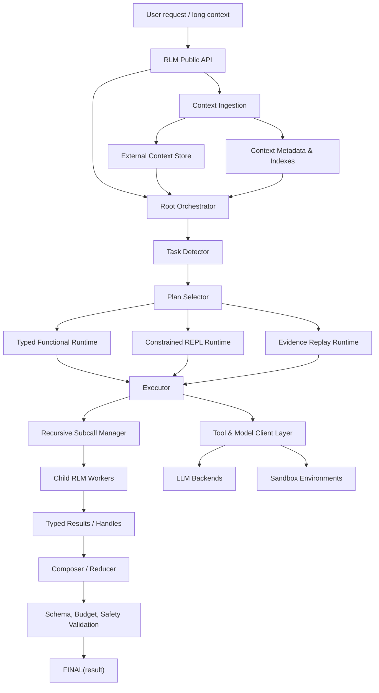
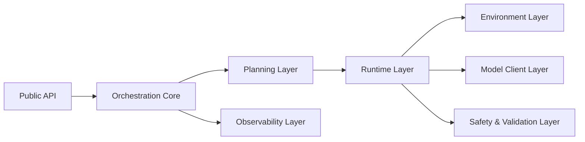
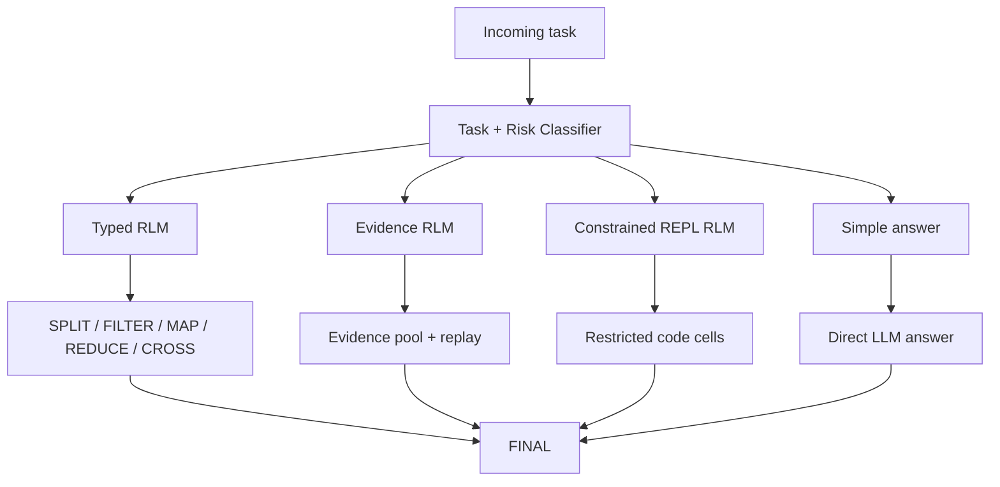
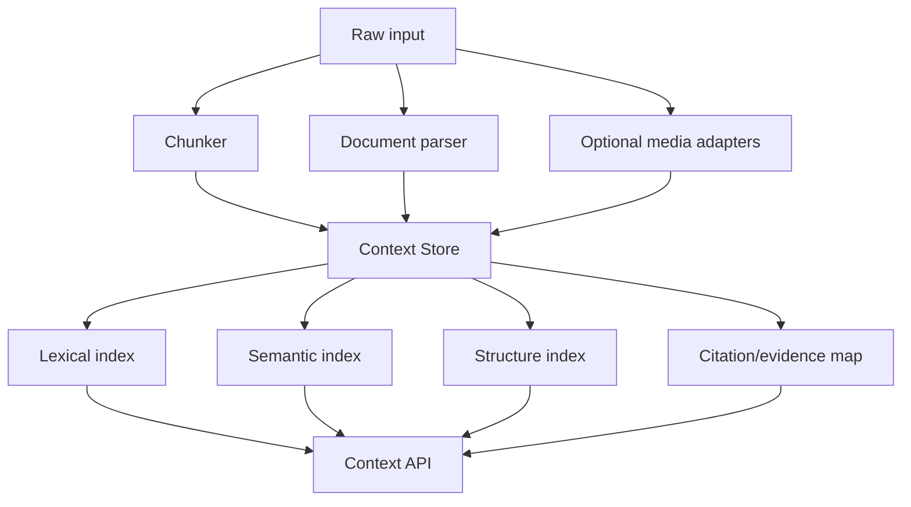
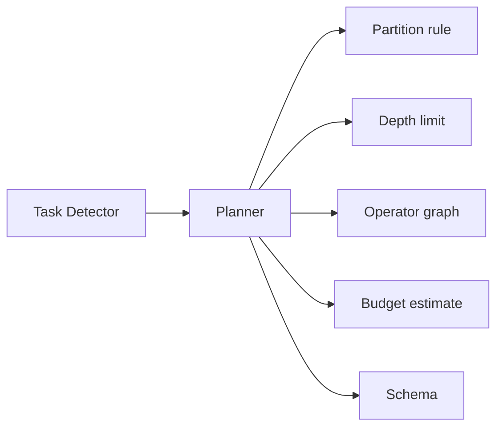
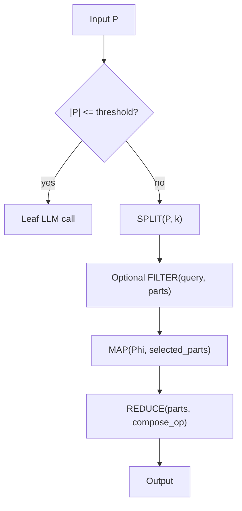
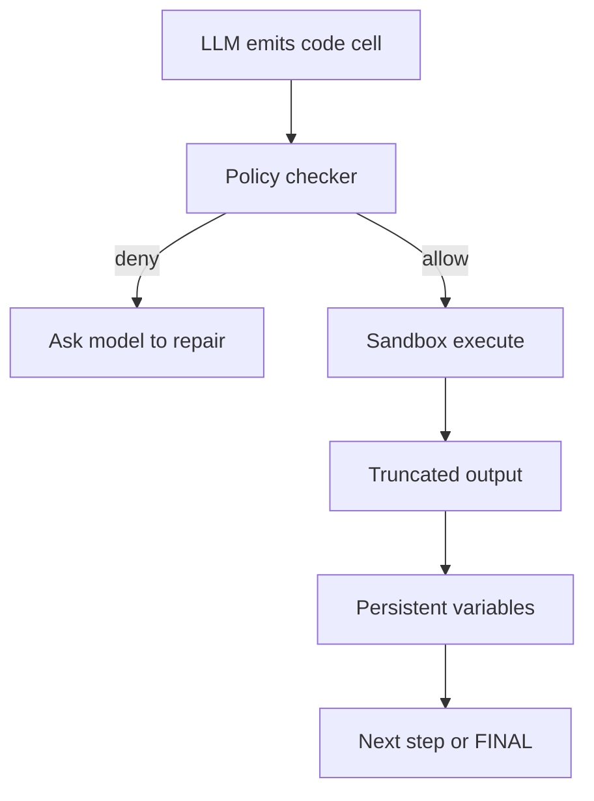
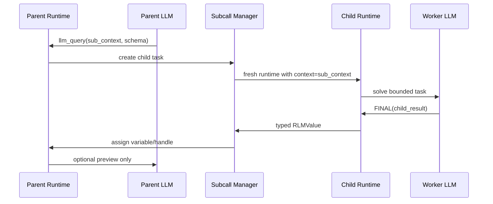
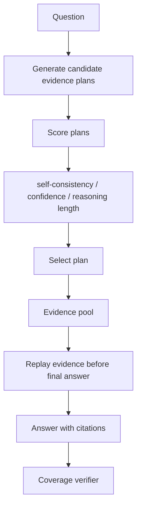
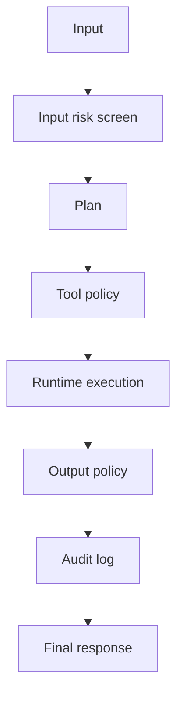

# Hybrid RLM Architecture

Tarih: 2026-07-05  
Amaç: Verilen RLM kaynaklarını, paper taramasını, `docs/rlmaha.md` notlarını ve `lambda-RLM` kod grafını birleştirerek uygulanabilir bir RLM mimarisi tanımlamak.

## Kısa Tanım

Bu mimari, klasik **Recursive Language Model** scaffold'unu λ-RLM çizgisindeki **typed functional runtime** ile birleştirir.

Temel karar:

- Varsayılan yürütme yolu **typed, deterministic, budgeted** olsun.
- Serbest REPL sadece kontrollü ve auditable bir escape hatch olarak kullanılsın.
- Uzun context doğrudan LLM context window'una basılmasın; dış ortamda `context` object olarak tutulsun.
- Alt görev çıktıları parent model context'ine otomatik yüklenmesin; parent runtime içinde typed value / handle olarak dönsün.
- Recursive depth, token, latency, cost ve evidence coverage runtime tarafından yönetilsin.

## Top-Level Architecture



## Component Layers



| Layer | Responsibility | Local source alignment |
|---|---|---|
| Public API | Kullanıcıya `RLM`, `LambdaRLM`, `completion`, `acompletion`, benchmark entry sunar. | `rlm/__init__.py`, `benchmarks/benchmark.py` |
| Orchestration Core | Prompt setup, context lifecycle, recursion, budget, timeout, token, error handling. | `rlm/core/rlm.py`, `rlm/core/lm_handler.py`, `rlm/core/comms_utils.py`, `rlm/core/types.py` |
| Planning Layer | Task type detection, recursion strategy, depth/partition selection, runtime mode seçimi. | `rlm/lambda_rlm.py`, SRLM/ReContext lessons |
| Runtime Layer | Typed combinator execution, constrained REPL execution, evidence replay, recursive subcalls. | `rlm/lambda_rlm.py`, `rlm/core/rlm.py` |
| Environment Layer | Local/Docker/Modal/E2B/Daytona/Prime sandboxları; `context`, `llm_query`, `FINAL` binding. | `rlm/environments/*` |
| Model Client Layer | OpenAI-compatible, Anthropic, Gemini, LiteLLM, Portkey, Azure adapters. | `rlm/clients/*` |
| Observability Layer | Trajectory logs, iteration logs, usage, console rendering, graph/debug view. | `rlm/logger/*`, `rlm/core/types.py` |
| Safety & Validation | Output schema, budget guard, tool policy, sandbox restrictions, evidence coverage. | `rlm/utils/exceptions.py`, typed runtime proposal |

## Runtime Modes

Mimari tek bir runtime değil, task'e göre seçilen üç runtime modundan oluşur.



| Mode | Ne zaman kullanılır | Güçlü yanı | Risk |
|---|---|---|---|
| Direct | Kısa, düşük riskli, basit cevaplar | En düşük latency | Verification yok |
| Typed RLM | Uzun context, özetleme, QA, extraction, classification | Termination/cost kontrolü, schema uyumu | Operator library kısıtlı olabilir |
| Evidence RLM | Cevap uzun context içindeki delile bağlıysa | ReContext/SRLM çizgisiyle evidence utilization artar | Evidence selection yanlışsa cevap eksik kalır |
| Constrained REPL RLM | Yeni veri dönüşümü, tabular parsing, bilinmeyen task decomposition | Esneklik | Opaque control flow, sandbox ve budget şart |

## Context Model

Context LLM mesajına doğrudan gömülmez. Runtime içinde object olarak tutulur.



Context API minimum yüzeyi:

```python
context.peek(start: int, length: int) -> str
context.search(query: str, *, top_k: int = 20) -> list[Span]
context.regex(pattern: str) -> list[Span]
context.slice(span: Span) -> str
context.children(node_id: str) -> list[ContextNode]
context.citations(spans: list[Span]) -> list[Citation]
```

RLM açısından önemli nokta: model sadece seçtiği parçaları görür. Runtime her `peek/search/slice` çağrısını loglar.

## Planner

Planner iki şeyi seçer:

1. Runtime mode.
2. Decomposition plan.



Task types:

- `summarization`
- `qa`
- `translation`
- `classification`
- `extraction`
- `analysis`
- `codebase-understanding`
- `safety-screening`
- `general`

Planning policy:

| Signal | Planner response |
|---|---|
| Context çok uzun, soru lokal evidence istiyor | Evidence RLM veya Typed RLM + `FILTER` |
| Output structured JSON/tablo | Typed RLM + schema validation |
| Task doğal olarak independent shards'a ayrılıyor | Parallel `MAP` |
| Task multi-hop veya cross-document | Recursive evidence replay + reducer |
| Task belirsiz ve operator yok | Constrained REPL with strict budget |
| Depth 1 başarısız / confidence düşük | SRLM-style candidate plan comparison |
| Depth 2 maliyeti hızla artıyor | Stop or fallback; overthinking guard |

## Typed Functional Runtime

λ-RLM kaynaklarından alınan ana fikir: LLM'e arbitrary control code yazdırmak yerine küçük ve doğrulanmış operator seti çalıştır.



Operator set:

| Operator | Contract | Typical use |
|---|---|---|
| `SPLIT` | `Context -> list[ContextSpan]` | Long document partition |
| `FILTER` | `(query, spans) -> list[ContextSpan]` | QA/extraction relevance |
| `MAP` | `(worker, spans) -> list[T]` | Parallel subproblem solving |
| `REDUCE` | `list[T] -> T` | Summaries, answers, votes |
| `CONCAT` | `list[str] -> str` | Translation, ordered stitching |
| `CROSS` | `list[A], list[B] -> list[(A,B)]` | Cross-document comparisons |
| `VERIFY` | `(answer, evidence) -> Verdict` | Safety and factuality check |

Typed value model:

```python
class RLMValue:
    value: Any
    schema: JsonSchema | PydanticModel | None
    evidence: list[Citation]
    cost: UsageSummary
    confidence: float | None
    provenance: list[RuntimeStep]
```

## Constrained REPL Runtime

Klasik RLM'nin güçlü tarafı korunur, ama açık uçlu execution sınırlanır.



REPL guardrails:

- File system default read-only.
- Network default kapalı.
- `print` output hard-truncated.
- Cell timeout.
- Memory limit.
- Import allowlist.
- Tool allowlist.
- No hidden global mutation of scaffold bindings: `context`, `llm_query`, `FINAL`, `SHOW_VARS`.
- Every execution step logged with code hash and output preview.

## Recursive Subcall Manager

Subcall çıktıları parent LLM context'ine otomatik basılmaz. Parent runtime'a typed handle olarak döner.



Manager responsibilities:

- `max_depth`
- `max_children`
- per-child budget
- parallel scheduling
- cancellation
- deduplication of identical subcalls
- KV-cache friendly message templates
- result schema validation
- provenance merge

## Evidence Runtime

SRLM ve ReContext çizgisini typed RLM içine ekleyen bölüm.



Evidence object:

```python
class EvidenceSpan:
    span_id: str
    source_id: str
    start: int
    end: int
    text_preview: str
    score: float
    reason: str
```

Coverage rule:

- Cevap fact içeriyorsa en az bir evidence span taşımalı.
- Multi-hop cevaplarda her hop ayrı span ile desteklenmeli.
- Evidence yoksa answer confidence düşürülmeli veya direct answer yerine "insufficient evidence" dönülmeli.

## Output Contract

RLM çıktısı sadece string değildir.

```python
class RLMCompletion:
    response: str | dict | list
    mode: Literal["direct", "typed", "evidence", "repl"]
    evidence: list[Citation]
    usage: UsageSummary
    trace_id: str
    warnings: list[str]
    confidence: float | None
    metadata: dict
```

`FINAL(...)` davranışı:

- `FINAL("text")`: normal response.
- `FINAL(dict/list/model)`: serialized structured output.
- `FINAL_VAR("name")`: REPL variable'ı doğrudan döndürür.
- `FINAL_WITH_EVIDENCE(answer, spans)`: evidence-aware response.

## Safety Architecture



Safety controls:

| Control | Purpose |
|---|---|
| Input normalization | Jailbreak/obfuscation defense için RLM-JB tarzı preprocessing |
| Chunk coverage | Split payload saldırılarını kaçırmamak |
| Tool policy | REPL/tool misuse engellemek |
| Output schema | Hallucinated or malformed structured output engellemek |
| Evidence verifier | Long-context factuality kontrolü |
| Budget guards | Overthinking/depth explosion engellemek |
| Audit trace | Reproducibility ve debugging |

## Recommended Module Layout

```text
rlm/
  __init__.py
  api.py
  core/
    orchestrator.py
    planner.py
    runtime_types.py
    subcalls.py
    budgets.py
    validation.py
  context/
    store.py
    chunking.py
    indexes.py
    evidence.py
  runtimes/
    direct.py
    typed.py
    evidence.py
    repl.py
    operators.py
  environments/
    base.py
    local.py
    docker.py
    e2b.py
    modal.py
  clients/
    base.py
    openai.py
    anthropic.py
    gemini.py
    litellm.py
  logger/
    trace.py
    verbose.py
  benchmarks/
    runner.py
    datasets.py
    metrics.py
```

Mapping to existing `lambda-RLM`:

| Proposed module | Existing analogue |
|---|---|
| `core/orchestrator.py` | `rlm/core/rlm.py` |
| `core/subcalls.py` | `rlm/core/lm_handler.py`, `rlm/core/comms_utils.py` |
| `runtimes/typed.py` | `rlm/lambda_rlm.py` |
| `runtimes/repl.py` | `rlm/core/rlm.py` + `rlm/environments/local_repl.py` |
| `runtimes/operators.py` | `SPLIT/FILTER/MAP/REDUCE` logic in `rlm/lambda_rlm.py` |
| `context/store.py` | `context` variable currently inside env |
| `logger/trace.py` | `rlm/logger/rlm_logger.py` |
| `benchmarks/runner.py` | `benchmarks/benchmark.py` |

## Execution Algorithm

```python
def rlm_completion(request: RLMRequest) -> RLMCompletion:
    context_ref = context_store.ingest(request.input)
    task = task_detector.detect(request, context_ref)
    plan = planner.plan(task, context_ref, request.constraints)

    if plan.mode == "direct":
        result = direct_runtime.run(plan)
    elif plan.mode == "typed":
        result = typed_runtime.run(plan, context_ref)
    elif plan.mode == "evidence":
        result = evidence_runtime.run(plan, context_ref)
    elif plan.mode == "repl":
        result = repl_runtime.run(plan, context_ref)
    else:
        raise InvalidPlanError(plan.mode)

    validated = output_validator.validate(result, request.output_schema)
    safety = safety_validator.check(validated)
    trace_logger.commit(plan, validated, safety)
    return completion_builder.build(validated, safety)
```

## Key Design Decisions

| Decision | Why |
|---|---|
| Hybrid runtime instead of pure REPL | RLM paper's flexibility is useful, but λ-RLM shows arbitrary REPL control is hard to verify. |
| Typed runtime as default | Better termination, cost bound, schema validation and auditability. |
| REPL as escape hatch | Some unknown tasks require programmatic exploration that fixed operators cannot express. |
| Evidence runtime included | SRLM/ReContext show plan/evidence selection matters as much as recursion. |
| Subcall outputs as values | This is the RLM "aha": parent does not need to read every child output token. |
| Depth guard by default | Reproduction work shows deeper recursion can overthink and explode latency. |
| Context store as first-class system | Long context is a data management problem, not only a prompt-size problem. |

## Minimal MVP

İlk uygulanacak küçük sürüm:

1. `ContextStore`: string input, chunking, search, slice.
2. `TypedRuntime`: `SPLIT`, `MAP`, `REDUCE`, `FILTER`.
3. `SubcallManager`: depth 1, parallel map, schema validation.
4. `LocalREPL`: sadece trusted/dev mode.
5. `RLMCompletion`: response, usage, trace, warnings.
6. `Benchmark`: normal RLM vs typed RLM karşılaştırması.

MVP dışı ama ikinci faz:

- SRLM-style plan search.
- ReContext evidence replay.
- RLM-JB safety profile.
- Docker/E2B sandbox hardening.
- Visual/video environment adapter.
- RecursiveMAS-style multi-agent loops.

## Evaluation Plan

| Benchmark type | What it tests |
|---|---|
| Long-context QA | Evidence retrieval + final answer quality |
| S-NIAH / needle tasks | Coverage and chunk search |
| Multi-document summarization | Split/map/reduce quality |
| Structured extraction | JSON schema correctness |
| Codebase understanding | Recursive decomposition over files |
| Jailbreak detection | RLM-JB style coverage and aggregation |
| Latency/cost | Overthinking and recursion overhead |

Metrics:

- Accuracy / F1 / exact match
- evidence coverage
- schema validity
- latency
- cost
- number of model calls
- max recursion depth
- tokens read vs total context size
- retry/error rate

## Final Architecture Summary

Bu mimarinin özü:

```text
RLM = external context store
    + planner
    + typed functional runtime
    + constrained REPL runtime
    + recursive subcall manager
    + evidence replay
    + schema/safety/budget validators
    + trace logging
```

Klasik RLM'den alınan güçlü fikir: context'i dışarıda tut, modelin seçerek okumasına izin ver, subtask'leri recursively çöz.  
λ-RLM'den alınan güçlü fikir: açık uçlu recursive code generation yerine doğrulanabilir typed operator graph kullan.  
SRLM/ReContext'ten alınan güçlü fikir: recursion tek başına yeterli değil; iyi plan/evidence seçimi gerekir.  
RLM-JB/VideoAtlas'tan alınan güçlü fikir: RLM bir text-only trick değil, environment tasarımı doğruysa güvenlik ve video gibi domain'lere taşınabilir.

